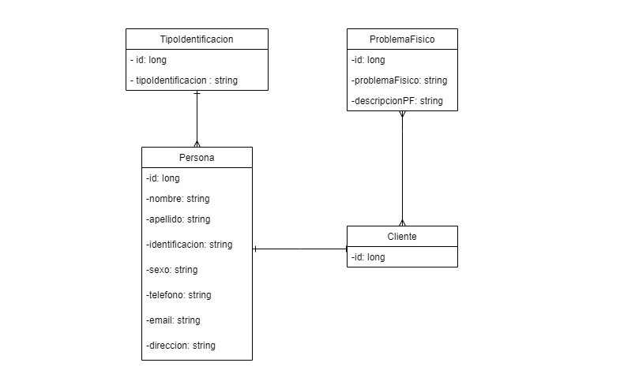
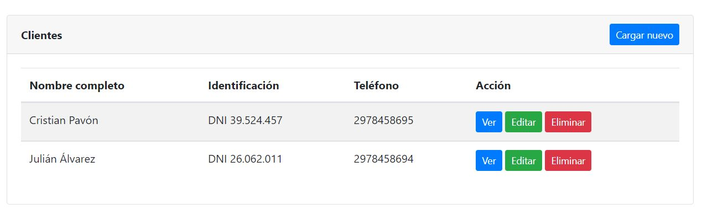
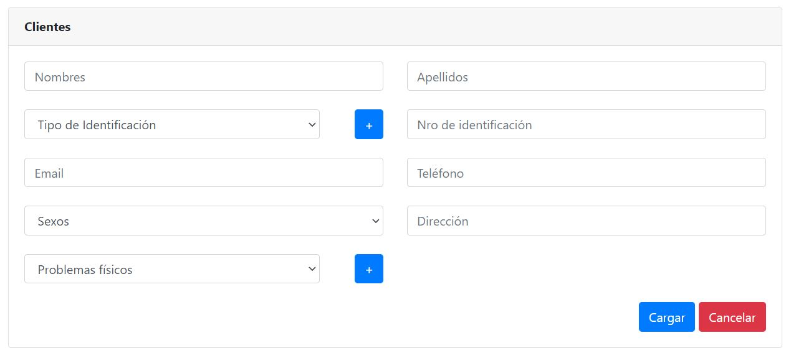

# Trabajo en equipo
Líder de la iteración: **Denis**.

Trabajos realizados por cada integrante:
* **Denis**: investigación y elección de las tecnologías a implementar. Diagrama de clases del sistema para esta iteración. Definición de las tareas a realizar para la implementación de los casos de uso.
* **Matías**: planificación de la iteración. Wireframes. Descripción de casos de uso.  Backlog de iteraciones. 

# Diseño OO

# Wireframes y casos de uso
## Wireframes
**Pantalla principal de clientes**

**Formulario para crear/modificar un cliente**

## Casos de uso

### Agregar cliente
* El usuario ingresa al módulo de clientes de la aplicación utilizando un navegador web.
* Se le presentará al usuario la vista principal del módulo de clientes.
* El usuario se dirigirá a la sección para agregar un nuevo cliente (*haciendo click en el botón "Cargar nuevo"*).
* El usuario será redirigido a la página correspondiente.
* Se le presentará un formulario donde podrá completar los campos con los datos del cliente a registrar.
* Cuando finalice la carga de datos, podrá registrar el cliente haciendo click en el botón *"Cargar"*.
* Si las restricciones de integridad de datos se cumplen satisfactoriamente, el cliente será correctamente registrado y el usuario será notificado del éxito de la operación mediante una notificación. Si una o más restricciones no se cumplen, no se permitirá cargar el cliente, y se señalará los campos que deben corregirse.
* Una vez cargado correctamente el cliente, el usuario será redirigido a la pantalla principal del módulo de clientes, donde verá listado de clientes actualizado.
* **Nota**: *el usuario podrá volver en todo momento a la pantalla anterior haciendo click en el botón "Volver", dejando sin efecto cualquier acción llevada a cabo hasta el momento*.

### Eliminar cliente
* El usuario ingresa al módulo de clientes de la aplicación utilizando un navegador web.
* Se le presentará al usuario la vista principal del módulo de clientes.
* El usuario buscará en la lista de clientes, la fila correspondiente a aquel cliente que desee eliminar del sistema. Una vez localizado, procederá a eliminarlo haciendo click en el botón *"Eliminar"* (de dicha fila).
* El sistema mostrará una ventana de advertencia, donde pedirá que el usuario confirme la eliminación de dicho cliente.
* Si el usuario confirma la eliminación, el registro del cliente será eliminado del sistema. Si cancela la eliminación, el sistema vuelve al listado principal sin eliminar el registro.

### Modificar cliente
* El usuario ingresa al módulo de clientes de la aplicación utilizando un navegador web.
* Se le presentará al usuario la vista principal del módulo de clientes.
* El usuario buscará en la lista de clientes, la fila correspondiente a aquel cliente cuyos datos desee modificar. Una vez localizado, ingresará al formulario correspondiente haciendo click en el botón *"Modificar"* (de dicha fila).
* Se le presentará un formulario donde podrá modificar los campos con los datos del cliente.
* Cuando finalice la modificación de datos, podrá guardar la nueva información del cliente haciendo click en el botón *"Guardar"*.
* Si las restricciones de integridad de datos se cumplen satisfactoriamente, los datos del cliente serán correctamente modificados y el usuario será notificado del éxito de la operación mediante una notificación. Si una o más restricciones no se cumplen, no se permitirá modificar los datos del cliente, y se señalará los campos que deben corregirse.
* Una vez modificados correctamente los datis del cliente, el usuario será redirigido a la pantalla principal del módulo de clientes, donde verá listado de clientes actualizado.
* **Nota**: *el usuario podrá volver en todo momento a la pantalla anterior haciendo click en el botón "Volver", dejando sin efecto cualquier acción llevada a cabo hasta el momento*.

### Consultar cliente
* El usuario ingresa al módulo de clientes de la aplicación utilizando un navegador web.
* Se le presentará al usuario la vista principal del módulo de clientes.
* El usuario buscará en la lista de clientes, la fila correspondiente a aquel cliente cuyos datos desee consultar. Una vez localizado, podrá consultar los detalles correspondientes haciendo click en el botón *"Ver"* (de dicha fila).
* Se le presentará una pantalla donde se detallará los datos del cliente en cuestión, listados en orden de importancia en un formato agradable a la vista.
* **Nota**: *el usuario podrá volver en todo momento a la pantalla anterior haciendo click en el botón "Volver", dejando sin efecto cualquier acción llevada a cabo hasta el momento*.

# Backlog de iteraciones
Historias de usuario a implementar en esta iteración:
* Como usuario, quiero registrar nuevos clientes para asociarlos a reservas de turnos.
* Como usuario, quiero gestionar la información de los clientes registrados para contar siempre con sus datos actualizados.

# Tareas
Lista tentativa de tareas a realizar para cumplir con lo planificado:

1) Instalar el entorno de desarrollo con sus respecivas tecnologías:
   * JDK 11
   * SpringBoot
   * MySQL
   * JUnit 5
   * Thymeleaf (motor de plantillas)
2) Configurar la base de datos.
3) Generar estructura de directorios (paquetes).
4) Generar los modelos del sistema (con JPA):
   * TipoIdentificación
   * Persona
   * Cliente
   * ProblemasFisicos
5) Generar los repositorios correspondientes para dichos modelos.
6) Integrar *Data Transfer Object (DTO)* para el transporte de los datos.
7) Generar los servicios para las clases.
8) Generar vistas y controladores para la clase Cliente.