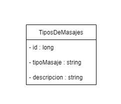
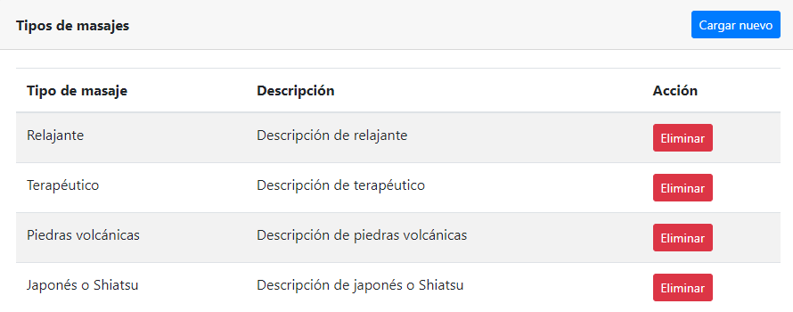
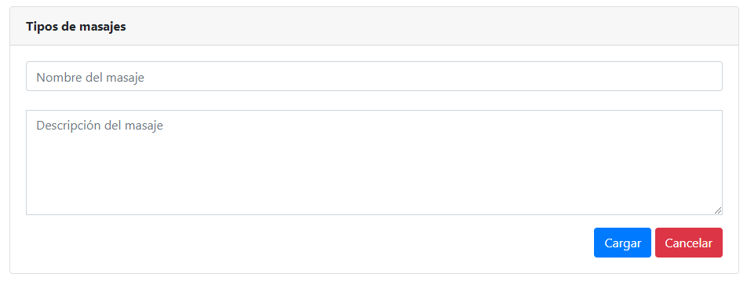

# Trabajo en equipo
Líder de la iteración: **Denis**.

Trabajos realizados por cada integrante:
* **Denis**: análisis del diseño de la iteración. Codificación.
* **Matías**: diseño y documentación de la iteración. Codificación.

# Diseño OO

# Wireframes y casos de uso
## Wireframes
**Pantalla principal de Tipos de Masajes**

**Formulario para crear un Tipo de Masaje**

## Casos de uso

### Agregar tipo de masaje
* El usuario ingresa al módulo de tipos de masajes de la aplicación utilizando un navegador web.
* Se le presentará al usuario la vista principal del módulo de tipos de masajes.
* El usuario se dirigirá a la sección para agregar un nuevo tipo de masaje (*haciendo click en el botón "Cargar nuevo"*).
* El usuario será redirigido a la página correspondiente.
* Se le presentará un formulario donde podrá completar los campos con los datos del tipo de masaje a registrar.
* Cuando finalice la carga de datos, podrá registrar el tipo de masaje haciendo click en el botón *"Cargar"*.
* Si las restricciones de integridad de datos se cumplen satisfactoriamente, el tipo de masaje será correctamente registrado y el usuario será notificado del éxito de la operación mediante una notificación. Si una o más restricciones no se cumplen, no se permitirá cargar el tipo de masaje, y se señalará los campos que deben corregirse.
* Una vez cargado correctamente el tipo de masaje, el usuario será redirigido a la pantalla principal del módulo de tipos de masajes, donde verá el listado de tipos de masajes actualizado.
* **Nota**: *el usuario podrá volver en todo momento a la pantalla anterior haciendo click en el botón "Volver", dejando sin efecto cualquier acción llevada a cabo hasta el momento*.

### Eliminar tipo de masaje
* El usuario ingresa al módulo de tipos de masajes de la aplicación utilizando un navegador web.
* Se le presentará al usuario la vista principal del módulo de tipos de masajes.
* El usuario buscará en la lista de tipos de masajes, la fila correspondiente a aquel tipo que desee eliminar del sistema. Una vez localizado, procederá a eliminarlo haciendo click en el botón *"Eliminar"* (de dicha fila).
* El sistema mostrará una ventana de advertencia, donde pedirá que el usuario confirme la eliminación de dicho tipo de masaje.
* Si el usuario confirma la eliminación, el registro del tipo de masaje será eliminado del sistema. Si cancela la eliminación, el sistema vuelve al listado principal sin eliminar el registro.

# Backlog de iteraciones
Historia de usuario a implementar en esta primera etapa de la iteración:
* Como usuario, quiero gestionar los distintos tipos de masajes que ofrece el centro para asociarlos a cada turno en particular.

# Tareas
Lista tentativa de tareas a realizar para cumplir con lo planificado:

1) Generar el modelo TiposDeMasajes (con JPA).
2) Generar el repositorio correspondiente para dicho modelo.
3) Configurar el *Data Transfer Object (DTO)* para el transporte de los datos.
4) Generar los servicios para la clase.
5) Generar vistas y controladores para la clase TiposDeMasajes.