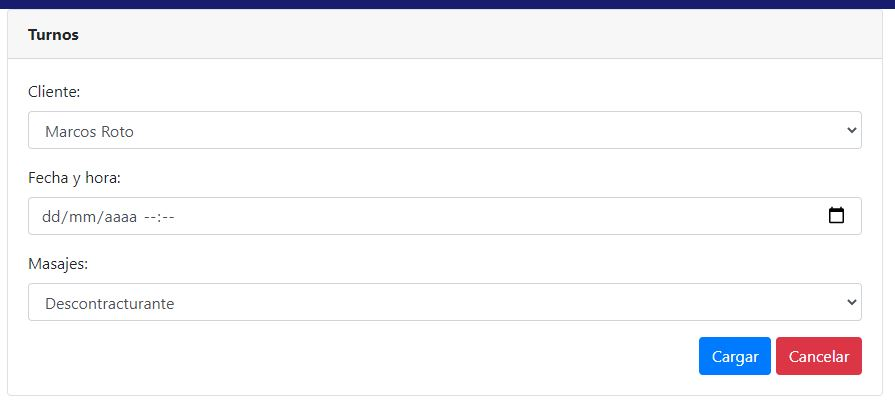

# Trabajo en equipo
Líder de la iteración: **Denis**.

Trabajos realizados por cada integrante:
* **Denis**: análisis del diseño de la iteración. Codificación.
* **Matías**: diseño y documentación de la iteración. Codificación.

# Diseño OO

# Wireframes y casos de uso
## Wireframes
**Pantalla principal de Turnos**

**Formulario para crear un nuevo Turno**

## Casos de uso

### Agregar turno
* El usuario ingresa al módulo de reservas de la aplicación utilizando un navegador web.
* Se le presentará al usuario la vista principal del módulo de turnos.
* El usuario se dirigirá a la sección para agregar un nuevo turno (*haciendo click en el botón "Cargar nueva"*).
* El usuario será redirigido a la página correspondiente.
* Se le presentará un formulario donde podrá completar los campos con los datos del turno a registrar.
* Cuando finalice la carga de datos, podrá registrar el turno haciendo click en el botón *"Cargar"*.
* Si las restricciones de integridad de datos se cumplen satisfactoriamente y el horario está disponible, el turno será correctamente registrado y el usuario será notificado del éxito de la operación mediante una notificación. Si una o más restricciones no se cumplen, no se permitirá cargar el turno, y se señalará los campos que deben corregirse.
* Una vez cargado correctamente el turno, el usuario será redirigido a la pantalla principal del módulo de reservas, donde verá el listado de turnos actualizado.
* **Nota**: *el usuario podrá volver en todo momento a la pantalla anterior haciendo click en el botón "Volver", dejando sin efecto cualquier acción llevada a cabo hasta el momento*.

### Eliminar turno
* El usuario ingresa al módulo de turnos de la aplicación utilizando un navegador web.
* Se le presentará al usuario la vista principal del módulo de turnos.
* El usuario buscará en la lista de turnos, la fila correspondiente a aquel que desee eliminar del sistema. Una vez localizado, procederá a eliminarla haciendo click en el botón *"Eliminar"* (de dicha fila).
* El sistema mostrará una ventana de advertencia, donde pedirá que el usuario confirme la eliminación de dicho turno.
* Si el usuario confirma la eliminación, el registro del turno será eliminada del sistema. Si cancela la eliminación, el sistema vuelve al listado principal sin eliminar el registro.

### Modificar turno
* El usuario ingresa al módulo de turnos de la aplicación utilizando un navegador web.
* Se le presentará al usuario la vista principal del módulo de turnos.
* El usuario buscará en la lista de turnos, la fila correspondiente a aquel cuyos datos desee modificar. Una vez localizado, ingresará al formulario correspondiente haciendo click en el botón *"Modificar"* (de dicha fila).
* Se le presentará un formulario donde podrá modificar los campos con los datos del turno.
* Cuando finalice la modificación de datos, podrá guardar la nueva información del turno haciendo click en el botón *"Guardar"*.
* Si las restricciones de integridad de datos se cumplen satisfactoriamente y el horario a reservar está disponible, los datos del turno serán correctamente modificados y el usuario será notificado del éxito de la operación mediante una notificación. Si una o más restricciones no se cumplen, no se permitirá modificar los datos del turno, y se señalará los campos que deben corregirse.
* Una vez modificados correctamente los datos del turno, el usuario será redirigido a la pantalla principal del módulo de turnos, donde verá listado de reservas actualizado.
* **Nota**: *el usuario podrá volver en todo momento a la pantalla anterior haciendo click en el botón "Volver", dejando sin efecto cualquier acción llevada a cabo hasta el momento*.

### Consultar turno
* El usuario ingresa al módulo de turnos de la aplicación utilizando un navegador web.
* Se le presentará al usuario la vista principal del módulo de turnos.
* El usuario buscará en la lista de turnos, la fila correspondiente a aquel cliente cuyos datos desee consultar. Una vez localizado, podrá consultar los detalles correspondientes haciendo click en el botón *"Ver"* (de dicha fila).
* Se le presentará una pantalla donde se detallará los datos del turno en cuestión.
* **Nota**: *el usuario podrá volver en todo momento a la pantalla anterior haciendo click en el botón "Volver", dejando sin efecto cualquier acción llevada a cabo hasta el momento*.
  
# Backlog de iteraciones
Historia de usuario a implementar en esta iteración:
* Como usuario, quiero gestionar las reservas de turno para tener mejor organizados los horarios del centro.

# Tareas
Lista tentativa de tareas a realizar para cumplir con lo planificado:

1) Generar el modelo Turnos (con JPA).
2) Generar el repositorio correspondiente para dicho modelo.
3) Configurar el *Data Transfer Object (DTO)* para el transporte de los datos.
4) Generar los servicios para la clase.
5) Generar vistas y controladores para la clase Turnos.