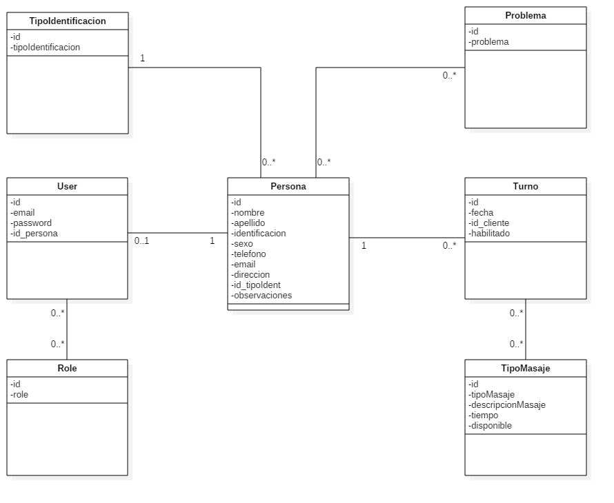

# Trabajo en equipo
Líder de la iteración: **Denis**.

Trabajos realizados por cada integrante:
* **Denis**: análisis del diseño de la iteración. Codificación.
* **Matías**: diseño y documentación de la iteración. Codificación.

# Diseño OO

  
# Backlog de iteraciones
Historia de usuario a implementar en esta iteración:
* Como usuario, quiero que los clientes puedan registrarse en el sistema y solicitar una reserva de turno, para evitar la comunicación por WhatsApp que a veces se vuelve tediosa.
* Como usuario, quiero aceptar o rechazar una solicitud de reserva de turno enviada por un cliente.

# Tareas
Lista tentativa de tareas a realizar para cumplir con lo planificado:

1) Permitir a los usuarios registrarse en el sistema con una cuenta propia.
2) Permitir editar los datos de todas las clases del sistema.
3) Permitir visualizar los datos del cliente.
4) Permitir al admin aprobar o rechazar la solicitud de reserva de turnos.
5)  Calcular tiempo de duración de turno.
6)  Controlar que no se solapen los turnos.
7)  Permitir cancelar turnos.