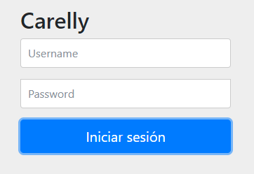

# Trabajo en equipo
Líder de la iteración: **Denis**.

Trabajos realizados por cada integrante:
* **Denis**: análisis del diseño de la iteración. Codificación.
* **Matías**: diseño y documentación de la iteración. Codificación.

# Diseño OO

# Wireframes y casos de uso
## Wireframes
**Pantalla de inicio de sesión**

## Casos de uso

### Iniciar sesión
* El usuario ingresa a la página principal de la aplicación utilizando un navegador web.
* Se le presentará al usuario el formulario para iniciar sesión o registrarse.
* Si el usuario tiene una cuenta creada y validada, debe ingresar su nombre de usuario y contraseña, e iniciar sesión (*haciendo click en el botón "Iniciar sesión"*).
* Si el usuario no tiene una cuenta creada, puede crearse una cuenta haciendo click en el botón "Registrarse" que se verá debajo del botón para iniciar sesión.
* Si ingresa los datos correctamente y se verifica la existencia de la cuenta, entonces el usuario será redirigido a la página principal.
* Se le presentará un formulario donde deberá completar sus datos personales antes de poder solicitar un turno.
* Cuando finalice la carga de datos, podrá guardar los cambios dando click en el botón *"Guardar"*.
* Una vez registrada correctamente la cuenta del usuario y con sus datos personales completos, el usuario podrá solicitar una reserva de turno.

  
# Backlog de iteraciones
Historia de usuario a implementar en esta iteración:
* Como usuario, quiero que los clientes puedan registrarse en el sistema y solicitar una reserva de turno, para evitar la comunicación por WhatsApp que a veces se vuelve tediosa.
* Como usuario, quiero aceptar o rechazar una solicitud de reserva de turno enviada por un cliente.

# Tareas
Lista tentativa de tareas a realizar para cumplir con lo planificado:

1) Permitir a los usuarios registrarse en el sistema con una cuenta propia.
2) Permitir editar los datos de todas las clases del sistema.
3) Permitir visualizar los datos del cliente.
4) Permitir al admin aprobar o rechazar la solicitud de reserva de turnos.
5)  Calcular tiempo de duración de turno.
6)  Controlar que no se solapen los turnos.
7)  Permitir cancelar turnos.